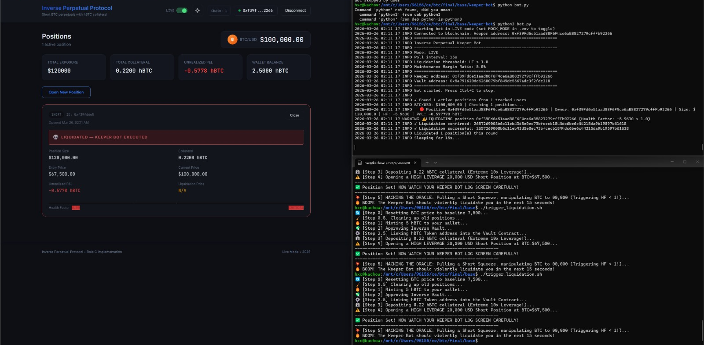
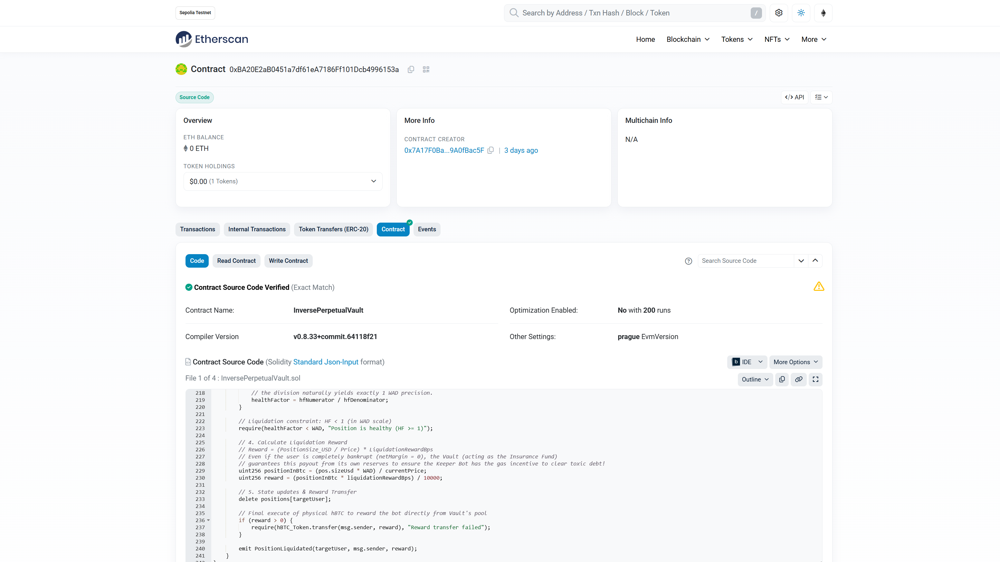
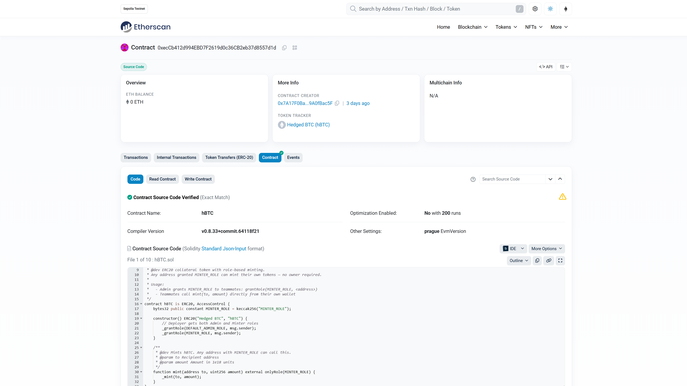
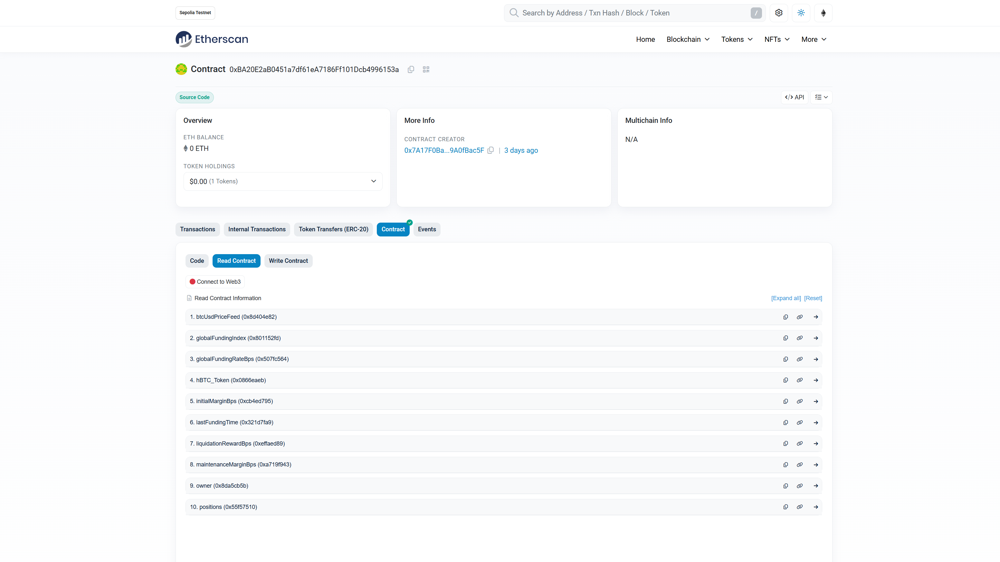

# Inverse Perpetual Swap Protocol
### NYU Tandon — Selected Topics in Financial Engineering | Final Project

> A fully on-chain, coin-margined (inverse) perpetual swap protocol deployed on **Ethereum Sepolia Testnet**, complete with a React trading dashboard and an automated Python liquidation keeper bot.


*Left: React trading dashboard showing a liquidated SHORT position. Right: Python keeper bot log and trigger script executing the full liquidation flow.*

---

## 📋 Table of Contents
1. [Project Overview](#-project-overview)
2. [System Architecture](#-system-architecture)
3. [Mathematical Model](#-mathematical-model)
4. [Smart Contracts](#-smart-contracts)
5. [Gas Report](#-gas-report)
6. [Test Suite](#-test-suite)
7. [Quick Start (Local)](#-quick-start-local)
8. [Sepolia Deployment](#-sepolia-deployment)
9. [Repo Structure](#-repo-structure)

---

## 🧠 Project Overview

This project implements an **Inverse Perpetual Swap** — a derivative instrument used extensively in crypto markets (first pioneered by BitMEX) where:

- **Collateral** is denominated in the underlying asset (BTC), not USD
- **P&L** is settled in BTC — meaning as BTC rises, your BTC-denominated returns are amplified
- **Shorting** is profitable in USD terms (price falls) but **requires BTC margin**, creating a natural hedge

This "inverse" structure is particularly interesting from a quantitative finance perspective because the position value is a **non-linear (convex) function of price**, unlike standard (linear) perpetuals.

### Key Design Decisions
| Feature | Implementation |
|---|---|
| Collateral token | `hBTC` — a mintable ERC20 representing Bitcoin |
| Price oracle | Chainlink AggregatorV3Interface (real BTC/USD on Sepolia) |
| Position tracking | WAD-scaled (1e18) fixed-point arithmetic |
| Risk engine | Off-chain Python Keeper Bot monitors Health Factor |
| Access control | OpenZeppelin `AccessControl` with role-based minting |

---

## 🏗 System Architecture

```
┌──────────────────────────────────────────────────────┐
│                   Sepolia Testnet                    │
│                                                      │
│  ┌─────────────┐        ┌───────────────────────┐   │
│  │  hBTC.sol   │◄──────►│ InversePerpetualVault  │   │
│  │  (ERC20)    │ approve│   .sol (Core Protocol) │   │
│  └─────────────┘        └───────────┬───────────┘   │
│                                     │ reads          │
│                          ┌──────────▼──────────┐    │
│                          │ Chainlink BTC/USD    │    │
│                          │ AggregatorV3 Oracle  │    │
│                          └─────────────────────┘    │
└──────────────────────────────────────────────────────┘
         ▲                          ▲
         │ ethers.js (read/write)   │ web3.py (monitor)
         │                          │
┌────────┴────────┐       ┌─────────┴─────────┐
│  React Frontend  │       │  Python Keeper Bot │
│  (Vite + ethers) │       │  (bot.py)          │
│  localhost:3000  │       │  polls every 30s   │
└─────────────────┘       └───────────────────┘
```


---

## 📐 Mathematical Model

### Position Value (Inverse Perpetual)

In a standard linear perpetual:
$$\text{PnL} = \text{Size} \times (\text{Exit Price} - \text{Entry Price})$$

In an **inverse** perpetual, the contract is denominated in BTC:
$$\text{PnL (BTC)} = \text{Size}_{USD} \times \left(\frac{1}{P_{entry}} - \frac{1}{P_{current}}\right)$$

This creates **convexity**: short positions have bounded downside but long positions have theoretically unlimited BTC-denominated profit as price rises.

### Health Factor

A position is solvent while its Health Factor (HF) ≥ 1:

$$HF = \frac{(\text{Collateral}_{BTC} + \text{uPnL}_{BTC}) \times P_{current}}{\text{Size}_{USD} \times r_{maintenance}}$$

Where $r_{maintenance} = 5\%$ is the maintenance margin ratio.

- **HF > 1.5**: Safe (green)
- **1.0 < HF < 1.5**: Warning (yellow)
- **HF < 1.0**: Liquidatable (red) — Keeper Bot executes liquidation

### WAD Fixed-Point Arithmetic

Solidity has no native floating-point. All calculations use **WAD scaling (1e18)**:

```solidity
uint256 WAD = 1e18;
// Chainlink price (8 decimals) → WAD (18 decimals)
uint256 currentPrice = uint256(chainlinkAnswer) * 10**10;

// Inverse P&L (SHORT):
int256 invEntry   = int256((WAD * WAD) / pos.entryPrice);
int256 invCurrent = int256((WAD * WAD) / currentPrice);
uPnL = (int256(pos.sizeUsd) * (invEntry - invCurrent)) / int256(WAD);
```

---

## 📄 Smart Contracts

### Deployed on Sepolia Testnet ✅

| Contract | Address | Etherscan |
|---|---|---|
| **InversePerpetualVault** | `0xBA20E2aB0451a7df61eA7186Ff101Dcb4996153a` | [View Verified ✅](https://sepolia.etherscan.io/address/0xBA20E2aB0451a7df61eA7186Ff101Dcb4996153a#code) |
| **hBTC Token** | `0xecCb412d994EBD7F2619d0c36CB2eb37d8557d1d` | [View Verified ✅](https://sepolia.etherscan.io/address/0xecCb412d994EBD7F2619d0c36CB2eb37d8557d1d#code) |
| **Chainlink BTC/USD Oracle** | `0x1b44F3514812d835EB1BDB0acB33d3fA3351Ee43` | [Chainlink Official](https://sepolia.etherscan.io/address/0x1b44F3514812d835EB1BDB0acB33d3fA3351Ee43) |







### Protocol Risk Parameters

| Parameter | Value | Description |
|---|---|---|
| `initialMarginBps` | 1000 (10%) | Required margin to open a position |
| `maintenanceMarginBps` | 500 (5%) | Minimum margin to keep position open |
| `liquidationRewardBps` | 500 (5%) | Keeper bot reward on liquidation |
| `globalFundingRateBps` | 1 (0.01%) | Periodic funding rate |

### hBTC Access Control

`hBTC` uses OpenZeppelin `AccessControl` with two roles:

| Role | `bytes32` | Capability |
|---|---|---|
| `DEFAULT_ADMIN_ROLE` | `0x000...0` | Grant/revoke roles |
| `MINTER_ROLE` | `keccak256("MINTER_ROLE")` | Call `mint(address, uint256)` |

```bash
# Admin grants minting rights to a teammate:
cast send $HBTC_ADDRESS "grantRole(bytes32,address)" \
  $(cast keccak "MINTER_ROLE") <TEAMMATE_ADDRESS> \
  --private-key $PRIVATE_KEY --rpc-url $RPC_URL
```

---

## ⛽ Gas Report

Measured via `forge test --gas-report` (7 tests, 0 failed).

### InversePerpetualVault

| Operation | Gas (Avg) | ~USD (10 gwei, $90k ETH) |
|---|---|---|
| Deployment | 2,289,390 | ~$2.06 |
| `openPosition()` | 110,279 | ~$0.10 |
| `depositCollateral()` | 73,965 | ~$0.07 |
| `liquidate()` | 85,185 | ~$0.08 |
| `setCollateralToken()` | 47,311 | ~$0.04 |
| `positions()` (view) | 10,122 | free (read-only) |

### hBTC Token

| Operation | Gas (Avg) |
|---|---|
| Deployment | 1,348,010 |
| `mint()` | 41,659 |
| `approve()` | 48,604 |

### Actual Sepolia Transactions

| Tx | Hash |
|---|---|
| Deploy Vault | [0xd2cec7...](https://sepolia.etherscan.io/tx/0xd2cec7a4e8b1597209b849b3c5b17d03c7800c8fb13bf29eddb8e13c00e1aab0) |
| Deploy hBTC | [0x27a823...](https://sepolia.etherscan.io/tx/0x27a823fdc9c73115495bee0d26c50e73850786f18ff2fd8015ac879802bc55f7) |
| setCollateralToken | [0x35c2d1...](https://sepolia.etherscan.io/tx/0x35c2d1e0087fadd0a14954e53e58c54142542a433e0ec2100a6fea3b947e6c40) |

---

## 🧪 Test Suite

```bash
forge test -vvv
```

| Test | Description | Gas |
|---|---|---|
| `test_depositCollateral` | hBTC approval and vault deposit | 150,820 |
| `test_openPosition` | WAD-scaled margin and size validation | 263,762 |
| `test_liquidate_short_pump` | Short squeeze: price $67,500 → $100,000 | 362,744 |
| `test_liquidate_with_quant_crash` | Long crash: price $60,000 → $30,000 | 408,316 |
| `test_RevertIf_InsufficientMargin` | Revert on undercollateralized open | 183,612 |
| `test_RevertIf_UnauthorizedRiskParameterUpdate` | Access control enforcement | 39,795 |
| `testFuzz_openPosition_mathTruncation` | 256-run fuzz: WAD precision across price range | μ: 307,990 |

**Result: 7/7 passed ✅**

---

## ⚡ Quick Start (Local Anvil)

### Prerequisites
```bash
# Foundry
curl -L https://foundry.paradigm.xyz | bash && foundryup

# Node.js (via nvm)
nvm install 18 && nvm use 18

# Python deps
cd keeper-bot && pip3 install -r requirements.txt
```

### Run the Full Stack

**Terminal 1 — Local Blockchain:**
```bash
anvil
```

**Terminal 2 — Deploy Contracts:**
```bash
forge script script/Deploy.s.sol:DeployVault \
  --rpc-url http://127.0.0.1:8545 \
  --private-key 0xac0974bec39a17e36ba4a6b4d238ff944bacb478cbed5efcae784d7bf4f2ff80 \
  --broadcast
# Update inverse-perp-ui/.env and keeper-bot/.env with printed addresses
```

**Terminal 3 — Frontend:**
```bash
cd inverse-perp-ui && npm install && npm run dev
# Open http://localhost:3000 → Connect MetaMask (Anvil Account 0) → Switch to LIVE
```

**Terminal 4 — Keeper Bot:**
```bash
cd keeper-bot && python3 bot.py
```

**Terminal 2 — End-to-End Liquidation Demo:**
```bash
./trigger_liquidation.sh
```

This script automatically: resets oracle → mints hBTC → opens a ~10x short position → spikes price to trigger keeper bot liquidation.


---

## 🌍 Sepolia Deployment

> See [`Integration_And_Deployment_Guide.md`](./Integration_And_Deployment_Guide.md) for the full step-by-step guide including teammate onboarding and hBTC minting instructions.

**Quick deploy:**
```bash
# Set up base/.env with PRIVATE_KEY and RPC_URL
forge script script/Deploy.s.sol:DeployVault \
  --rpc-url $RPC_URL \
  --private-key $PRIVATE_KEY \
  --broadcast
```

The deploy script auto-detects the network:
- **`chainid == 31337` (Anvil)**: Deploys a `MockAggregator` seeded at $67,500
- **`chainid == 11155111` (Sepolia)**: Uses the real Chainlink BTC/USD feed

---

## 📁 Repo Structure

```
base/
├── src/
│   ├── InversePerpetualVault.sol   # Core vault: margin, positions, liquidation
│   ├── hBTC.sol                    # ERC20 collateral token (AccessControl)
│   └── interfaces/
│       └── AggregatorV3Interface.sol
├── test/
│   ├── InversePerpetualVault.t.sol # 7-test Foundry suite
│   └── mocks/MockAggregator.sol    # Controllable price feed for local testing
├── script/
│   └── Deploy.s.sol                # Network-aware deployment script
├── inverse-perp-ui/                # React + Vite trading dashboard
│   └── src/
│       ├── hooks/useContract.js    # Blockchain polling (5s live, mock simulation)
│       └── constants/contracts.js  # ABI + env-driven addresses
├── keeper-bot/
│   ├── bot.py                      # Liquidation monitor (web3.py)
│   ├── health.py                   # Health Factor math (mirrors Solidity WAD)
│   └── requirements.txt
├── trigger_liquidation.sh          # One-shot end-to-end demo script
├── Integration_And_Deployment_Guide.md
├── hBTC_ABI.json
└── InversePerpetualVault_ABI.json
```

---

## 👥 Team

NYU Tandon — Selected Topics in Financial Engineering, Spring 2026

---

*Deployed on Ethereum Sepolia Testnet. Not for production use.*
